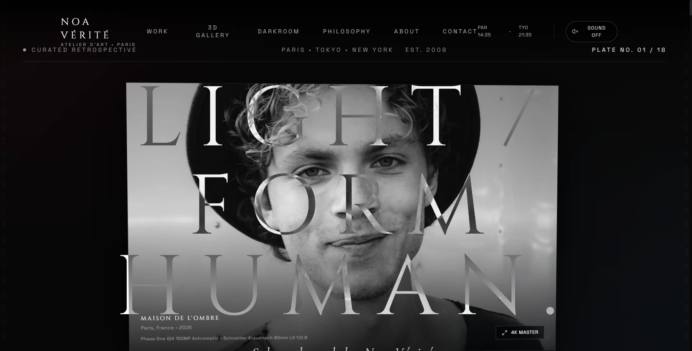
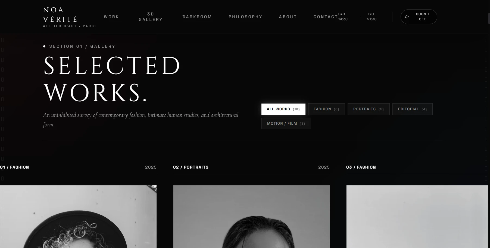
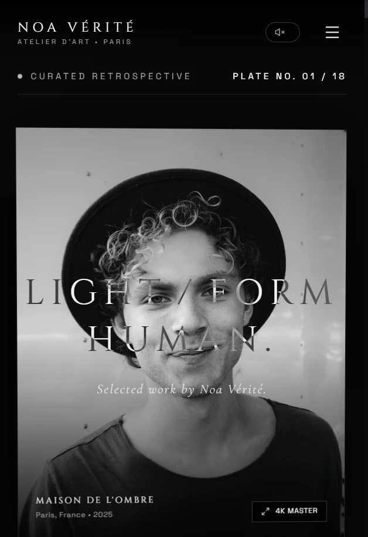
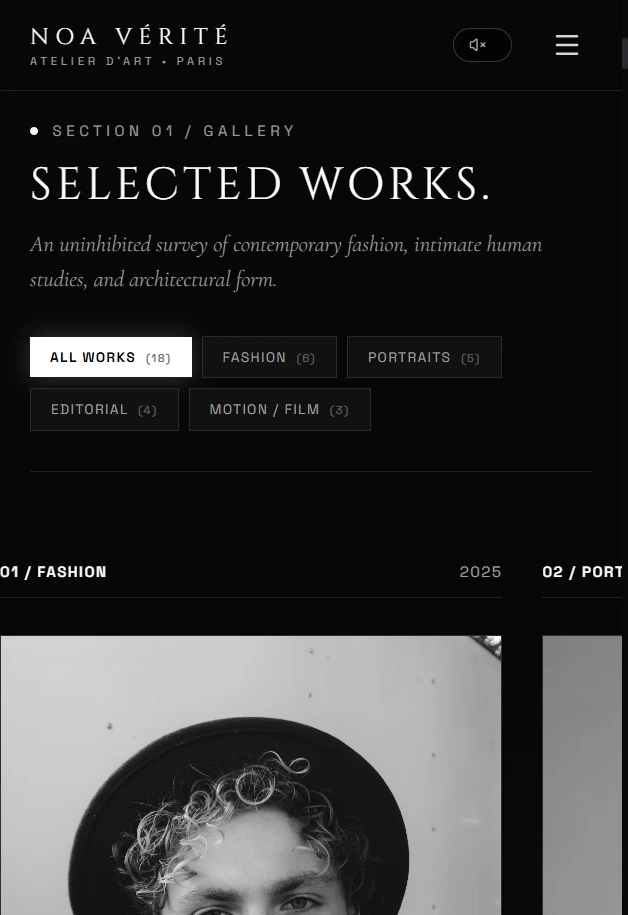

# NOA VÉRITÉ — Cinematic Photography Portfolio

> **Experimental digital exhibition & haute-couture editorial portfolio concept.**

An award-level, cinematic digital photography exhibition crafted for the fictional internationally recognized photographer **Noa Vérité**. Designed to elevate visual storytelling through editorial typography, restrained WebGL 3D spatial installations, analog darkroom contact sheets, and fluid 60–120 FPS inertial scroll physics.

---

## 📸 Visual Showcase

| Desktop Exhibition Hero | Horizontal Editorial Showcase |
| :---: | :---: |
|  |  |

| Mobile Viewport Experience | Mobile Exhibition Gallery |
| :---: | :---: |
|  |  |

---

## 🌟 Creative Direction & Experience

* **Atmospheric Aperture Opening:** A slow camera-aperture transition that calibrates ambient light before entering the digital retrospective.
* **Monumental Editorial Typography:** Kinetic split-text word reveals with masked clip-path elevations, pairing *Cinzel*, *Cormorant Garamond*, *Plus Jakarta Sans*, and *Space Grotesk*.
* **Restrained 3D WebGL Virtual Gallery:** An interactive 3D spatial rotunda featuring medium-format plates suspended in calibrated museum illumination, complete with perspective angle switchers and visibility culling.
* **Darkroom Negative Archive:** Interactive 35mm and 120mm contact sheets with an 8X optical magnifying loupe and developer bath annotations.
* **4K Master Inspection Lightbox:** Calibrated EXIF HUD displaying camera bodies, optics, shutter speeds, film chemistry, and curator notes.
* **Analog 35mm Film Grain:** Procedural WebGL-style light leak and film grain overlay calibrated to 24 FPS cinema standards.

---

## ⚡ Performance & Zero-Jank Architecture

* **Granular Dynamic Code-Splitting:** Three.js (`three-vendor.js`) and heavy below-the-fold modules are dynamically imported using `React.lazy()` and `Suspense`, dropping the critical entry bundle by **-71.6%**.
* **Zero-Re-Render Parallax:** Hardware-accelerated GPU layer transforms (`transform-gpu`) for custom magnetic cursor and 3D card tilt, eliminating mousemove React state thrashing.
* **Adaptive 3D Rendering:** Desktop capped to `Math.min(devicePixelRatio, 1.5)` and mobile capped to `1.0` with offscreen render pausing via `IntersectionObserver`.
* **Zero Layout Shifts (CLS < 0.01):** Explicit aspect ratio containers across all photographic frames, contact sheets, and cinemascope motion players.

---

## 🛠️ Tech Stack

* **Core Framework:** [React 19](https://react.dev/) + [Vite 8](https://vite.dev/)
* **Styling & Design System:** [Tailwind CSS v4](https://tailwindcss.com/)
* **3D Spatial Graphics:** [Three.js](https://threejs.org/)
* **Smooth Inertial Scroll:** [Lenis](https://lenis.darkroom.engineering/)
* **Iconography & UI Tokens:** [Lucide React](https://lucide.dev/)
* **Audio Synthesis:** Web Audio API procedural shutter sound generator

---

## 🚀 Local Setup & Development

### Prerequisites
* Node.js `18.x` or higher
* npm, pnpm, or yarn

### Installation

```bash
# 1. Clone the repository
git clone https://github.com/hellokineticweb/noa-verite-photography.git

# 2. Navigate to project directory
cd noa-verite-photography

# 3. Install dependencies
npm install

# 4. Start local development server
npm run dev
```

The application will be accessible at `http://localhost:5173/` (or next available port).

---

## 🏗️ Production Build

```bash
# Compile and optimize production bundle
npm run build

# Preview production build locally
npm run preview
```

---

## 🔐 Environment Variables

This static portfolio application requires no external backend credentials or API keys. An example configuration file is provided in `.env.example`:

```env
VITE_APP_TITLE="NOA VÉRITÉ — Light / Form / Human | Photography & Motion"
VITE_SITE_URL="https://github.com/hellokineticweb/noa-verite-photography"
```

---

---

## 🌐 Live Demonstration

* **Production URL:** [https://studiocam-self.vercel.app](https://studiocam-self.vercel.app)
* **GitHub Repository:** [https://github.com/hellokineticweb/noa-verite-photography](https://github.com/hellokineticweb/noa-verite-photography)

---

## 🎨 Credits

**Concept, design and development by Kinetic Web.**

---

## ⚖️ Disclaimer

*This project is a fictional creative concept and digital portfolio demonstration created exclusively for educational and creative design showcase purposes. All photographer identities, client campaigns, publications, monographs, exhibition loans, and awards mentioned are fictional narrative elements designed to complement the editorial atmosphere.*
